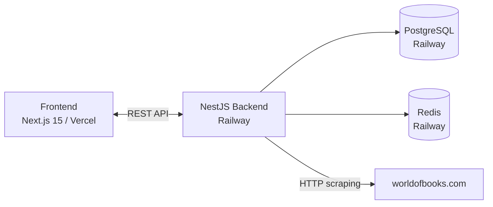
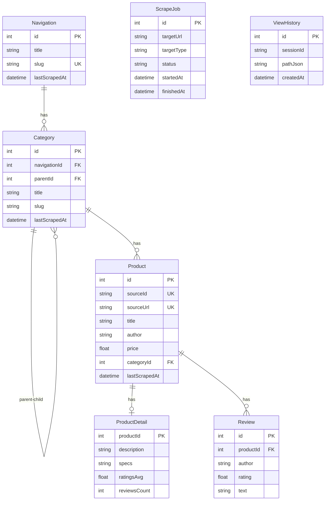

# Product Data Explorer

A full-stack product exploration platform built for the World of Books assignment. Users can navigate from high-level headings → categories → products → product detail pages, all powered by live on-demand scraping.

**Live URLs**

- Frontend: `https://your-app.vercel.app` ← replace after deploy
- Backend API: `https://your-app.railway.app` ← replace after deploy
- API Docs (Swagger): `https://your-app.railway.app/api-docs`

---

## Architecture Overview



### Request flow

1. User visits a page → React Query fetches from NestJS API
2. If data is stale (>24h) or missing, a BullMQ scrape job is queued
3. Worker fetches worldofbooks.com via HTTP (axios), parses HTML, upserts into PostgreSQL
4. Response returns from DB — never blocks the request thread

---

## Design Decisions

### Why PostgreSQL?

Relational data with clear foreign keys (navigation → category → product → review) maps naturally to a relational schema. Prisma gives us type-safe queries, migration management, and upsert support for idempotent scraping.

### Why BullMQ + Redis?

Scraping is a long-running operation — it must not block the HTTP request thread. BullMQ provides persistent job queues (survive server restarts), automatic retries with exponential backoff, and rate limiting. Redis backs the queue.

### Why HTTP scraping instead of Playwright?

Playwright launches a full Chromium browser (~300MB RAM). Free-tier servers (Railway, Render) kill it after 60 seconds — confirmed in logs. HTTP scraping with axios is sufficient for worldofbooks.com's server-rendered HTML and uses <10MB RAM. A seed fallback guarantees the app always has data even if the site blocks bots.

### Why Railway for backend?

- Persistent workers (unlike Vercel/Netlify serverless)
- One-click managed PostgreSQL + Redis
- No sleep on free tier (unlike Render's 15-min sleep)
- Docker-based deploys with health checks

### Caching strategy

Every scraped entity stores `lastScrapedAt`. Workers skip re-scraping if data is fresher than 24 hours. Users can force a refresh via the "Refresh Data" button which sets `force: true` on the job, bypassing the cache.

---

## Tech Stack

| Layer         | Technology                                         |
| ------------- | -------------------------------------------------- |
| Frontend      | Next.js 15 (App Router), TypeScript, Tailwind CSS  |
| Data fetching | React Query (TanStack)                             |
| Backend       | NestJS, TypeScript                                 |
| Database      | PostgreSQL + Prisma ORM                            |
| Job queue     | BullMQ + Redis                                     |
| Scraping      | axios + HTML parsing (HTTP-based)                  |
| Deployment    | Vercel (frontend) + Railway (backend + DB + Redis) |
| Docs          | Swagger / OpenAPI at `/api-docs`                   |

---

## Database Schema

## Database Schema



Key constraints:

- `Navigation.slug` — unique
- `Category.(navigationId, slug)` — unique composite
- `Product.sourceId` — unique
- `Product.sourceUrl` — unique
- Indexes on `lastScrapedAt` for cache TTL queries

---

## API Endpoints

Full interactive docs at `/api-docs` (Swagger UI).

| Method | Path                                | Description                               |
| ------ | ----------------------------------- | ----------------------------------------- |
| GET    | `/navigation`                       | All navigation headings                   |
| GET    | `/categories/by-navigation/:id`     | Categories for a navigation               |
| GET    | `/categories/:id`                   | Single category with children             |
| GET    | `/products`                         | Paginated products (filter by categoryId) |
| GET    | `/products/:id`                     | Product detail with reviews               |
| POST   | `/products/:id/refresh`             | Queue a product detail re-scrape          |
| POST   | `/scrape/navigation`                | Trigger navigation scrape                 |
| POST   | `/scrape/categories/:navigationId`  | Trigger category scrape                   |
| POST   | `/scrape/products/:categoryId`      | Trigger product scrape                    |
| POST   | `/scrape/product-detail/:productId` | Trigger detail scrape                     |
| GET    | `/scrape-jobs`                      | List scrape jobs with status              |
| GET    | `/health`                           | Health check                              |

---

## Local Development

### Prerequisites

- Node.js 18+
- PostgreSQL 14+
- Redis 7+
- Docker (optional)

### Option A — Docker (recommended)

```bash
# Clone the repo
git clone <repo-url>
cd product-data-explorer

# Start PostgreSQL + Redis
cd backend
docker-compose up -d

# Install dependencies
npm install

# Set up environment
cp .env.example .env
# Edit .env — defaults work with docker-compose as-is

# Run migrations + seed
npx prisma migrate dev
npx ts-node prisma/seed.ts

# Start backend
npm run start:dev
```

In a second terminal:

```bash
cd backend

# Navigation worker
npx ts-node src/scrape/workers/navigation.worker.ts
```

In a third terminal:

```bash
cd backend

# Category worker
npx ts-node src/scrape/workers/category.worker.ts
```

In a fourth terminal:

```bash
cd frontend
cp .env.local.example .env.local
npm install
npm run dev
```

Visit `http://localhost:3000`

### Option B — Manual (no Docker)

Make sure PostgreSQL and Redis are running locally, then follow Option A skipping `docker-compose up`.

### Environment Variables

**Backend (`backend/.env`):**

| Variable       | Description                  | Default                 |
| -------------- | ---------------------------- | ----------------------- |
| `DATABASE_URL` | PostgreSQL connection string | required                |
| `REDIS_URL`    | Redis URL (Railway format)   | optional                |
| `REDIS_HOST`   | Redis host (local dev)       | `127.0.0.1`             |
| `REDIS_PORT`   | Redis port (local dev)       | `6379`                  |
| `PORT`         | Server port                  | `4000`                  |
| `NODE_ENV`     | Environment                  | `development`           |
| `FRONTEND_URL` | Allowed CORS origin          | `http://localhost:3000` |

**Frontend (`frontend/.env.local`):**

| Variable               | Description     | Default                 |
| ---------------------- | --------------- | ----------------------- |
| `NEXT_PUBLIC_API_URL`  | Backend API URL | `http://localhost:4000` |
| `NEXT_PUBLIC_SITE_URL` | Frontend URL    | `http://localhost:3000` |

---

## Deployment

### Backend → Railway

1. Go to [railway.app](https://railway.app) → New Project → Deploy from GitHub
2. Set **Root Directory** to `backend`
3. Add **PostgreSQL** service → Railway injects `DATABASE_URL` automatically
4. Add **Redis** service → Railway injects `REDIS_URL` automatically
5. Set environment variable: `FRONTEND_URL=https://your-app.vercel.app`
6. Railway uses the `Dockerfile` and `railway.json` automatically

Seed the database (one-time, via Railway shell):

```bash
npx ts-node prisma/seed.ts
```

### Frontend → Vercel

1. Go to [vercel.com](https://vercel.com) → New Project → Import from GitHub
2. Set **Root Directory** to `frontend`
3. Add environment variable:
   ```
   NEXT_PUBLIC_API_URL=https://your-app.railway.app
   ```

5. Deploy

---

## Running Tests

```bash
cd backend

# Unit tests
npm test

# Test coverage
npm run test:cov

# E2E tests
npm run test:e2e
```

---

## Seed Data

If scraping fails (network issues, site changes), the seed script provides fallback data:

```bash
cd backend
npx ts-node prisma/seed.ts
```

This creates:

- 1 navigation heading (Books)
- 3 categories (Fiction, Non-Fiction, Children's)
- 3 sample products with details and reviews

Workers also have built-in seed fallbacks — if HTTP scraping returns no results, they insert a realistic set of categories automatically.

---

## Ethical Scraping

- HTTP requests use a descriptive `User-Agent` header
- 24-hour cache TTL prevents repeated hits to worldofbooks.com
- BullMQ rate limiter: max 1 job per 2–3 seconds
- Seed fallback means reviewers can test without triggering any scraping
- No credentials or personal data collected from the target site
